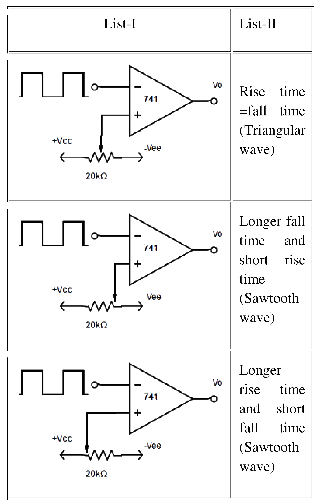
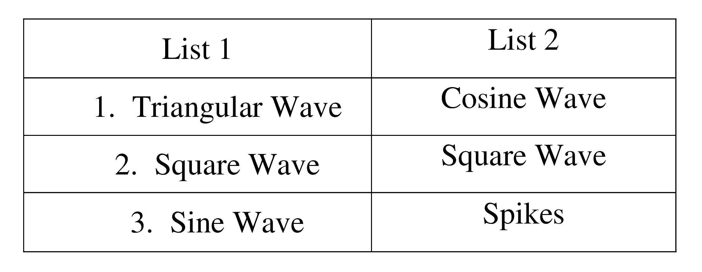

## Post test
#### Please attempt the following questions

Q1. How many inputs can be given to an op-amp for performing addition operation?  

A  Two  
B  Three  
C  Four  
<b>D  Any number</b>  
 
  
  
Q2. In which of the following operations is the resulting output signal of the differential amplifier near zero?  

A  Single-ended  
B  Double-ended  
<b>C  Common-mode</b>  
D  None of the above  
 
  
  
Q3. What will be the output of given circuit when V1 = 4V and V2 = 2V?
 
  

<b>A  \-2 V</b>  
B  2 V  
C  6 V  
D  \-6 V  
 
  
 
Q4. Two voltages of +0.6V and -1.4V are applied to the input resistors of a summing amplifier. The respective input resistors are 400 kΩ and 100 kΩ and feedback resistor is 200 kΩ. Determine the output voltage  

A  2.0 V  
<b>B  2.5 V</b>  
C  0.8 V  
D  3.0 V  
 
  

Q5. Find the output voltage of a differentiator circuit consisting of a resistor of 1 kΩ and a capacitor of 0.1µF if input varies from 0V to 5V in 0.1 ms.  
  

<b>A  \-5 V</b>  
B  5 V  
C  \-5.5 V  
D  5.5 V  
 

Q6. Determine the critical frequency for the integrator circuit shown in figure.  
  

A  100 Hz  
B  232 Hz  
<b>C  159 Hz</b>  
D  265 Hz  
 

Q7. What is the cutoff frequency of an op-amp if the unity-gain frequency is 1.5 MHz and the open-loop gain is 100,000?  

A  5 Hz  
B  10 Hz  
<b>C  15 Hz</b>  
D  20 Hz  
 

Q8. Calculate the output voltage shown in the figure below for Rf =68 kΩ.  
  

A  3.38 V  
B  \-3.68 V  
<b>C  \-3.39 V</b>  
D  3.52 V  
 

Q9. What output voltage results in the circuit of the figure given below for V1 =+0.5V  
  

<b>A  0.5 V</b>  
B  1.5 V  
C  0.9 V  
D  2.0 V  
 

Q10. Calculate the output voltage for the circuit of given figure. The input are V1 = 50 sin(1000 t) mV and V2= 10 sin(3000 t) mV  
  

<b>A  –\[0.5 sin(1000 t) +0.33 sin(3000 t)\]</b>  
B  \[0.5 sin(1000 t) +0.33 sin(3000 t)\]  
C  \[0.33 sin(1000 t) +0.5 sin(3000 t)\]  
D  \-\[0.33 sin(1000 t) +0.5 sin(3000 t)\]  

 

  