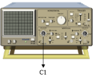
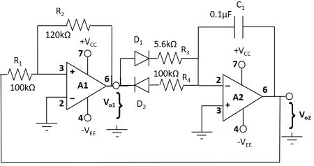

#### Familiarise with components

**1.** Click on the components button to place the component on the table. 

   

&emsp; &emsp; &emsp; &emsp; &emsp;   &emsp; &emsp; &emsp; &emsp; ")&emsp; ")&emsp;
 
**Fig 1: Components**

**2.** Make connections as per the circuit diagram or connection table.

 

  

**Fig 2: Circuit diagram of sawtooth wave generator.**

**Table 1: Connection table of sawtooth wave generator.**

 

**3.** Connect output of the circuit to channel CH1 of C.R.O.  
**4.** Click on **'Check Connection'** button to check connections. If correct, Click on **'Show wave'** button to view the output waveform and adjust the C.R.O.  
**5.** Measure the frequency of generated sawtooth wave from C.R.O.  
**6.** Calculate the frequency of output wave using the formula:  

**f = (1/(2\*C1\*(R3+R4)))\*(R2/R1)**

**7.** Compare the calculated frequency with the experimentally measured frequency by clicking on **'Show result'** button. Enter experimentally measured frequency.

 
