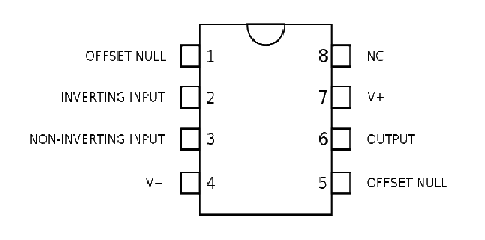

### Introduction

An operational amplifier is an amplifier which has high open loop gain, very high input impedance, very low output impedance and large bandwidth. This amplifier is a direct coupled device with differential inputs and a single ended output. The amplifier responds only to the difference voltage between the two input terminals. Fig.1(a) shows the most widely used symbol for a circuit with two inputs and one output. For simplicity, power supply and other pin connections are omitted. Since the input differential amplifier stage of the op amp is designed to be operated in the differential mode, the differential inputs are designated by the (+) and (-) notations. The (+) input is the non inverting input. An ac signal (or dc voltage) applied to this input produces an in phase (or same polarity) signal at the output. On the other hand, the (-) input is the inverting input because an ac signal (or dc voltage) applied to this input produces an180" out of-phase (or opposite polarity) signal at the output.

InFig. 1(a),  
Vb = Voltage at the noninverting input (volts)  
Va = Voltage at the inverting input (volts)  
Vo = Output voltage (volts)  
All these voltages are measured with respect to ground.  
A= Large-signal voltage gain, which is specified on the data sheet for an op-amp

Fig. 1(b) shows an equivalent circuit of an op-amp. This circuit includes important values from the data sheets: A, Rin, and Rout. Here AVin is an equivalent Thevenin voltage source, and Rout is the Thevenin equivalent resistance looking back into the output terminal of an op-amp. The equivalent circuit is useful in analyzing the basic operating principles of op-amps and in observing the effects of feedback arrangements. For the circuit shown in Fig. 1(b), the output voltage is

Vo = AVin = A(Vb – Va)

where  
Vin = Difference input voltage  
Above equation indicates that the output voltage Vo is directly proportional to the algebraic difference between the two input voltages. The output signal is single ended and is referred w.r.t. the ground.

  

.png)

**Fig.-1(a): Schematic symbol for the op amp**

.png)

**Fig.-1(b): Equivalent circuit of an op amp**

The op-amp is a versatile device that can be used to amplify d.c. as well as a.c. input signals and was originally designed to perform mathematical operations such as addition, subtraction, multiplication, division, integration and differentiation. Thus the name operational amplifier stems from its original use for these mathematical operations and is abbreviated to op-amp.

IC 741 usually called as op-amp 741 is 8 pin dual in line package (DIP) integrated circuit consists of 8 pins as shown in Fig. 2. Terminals 2 and 3 are called input terminals. Signal applied to terminal 2 is arrived at the output terminal with the negative sign hence it is called inverting terminal while the signal applied to the terminal 3 is arrived with same sign at the output hence it is called non-inverting terminal. Power suppliesof +15 V and -15 V are applied at terminals 7 and 4 respectively. The output is obtained at the terminal 6. Terminal 1 is offset null because it has no use in general operations. The name op-amp 741 is given to this integrated circuit as it is clear from its pin configuration that there are 7 active pins having 4 input terminals(2, 3, 4 and 7) and one output terminal (6th terminal).

   

.png)

**Fig. 2 Pin diagram of an op-amp IC 741**

### **Adder**

Fig. 3 shows the inverting configuration with three inputs V1, V2 and V3. Depending on the relationship between the feedback resistance Rf and the input resistors R1, R2 and R3, which can be used as a summing amplifier. The circuit’s function can be verified by examining the expression for the output voltage. In this configuration of op-amp when the three inputs V1, V2 and V3 are applied at the inverting terminal then they produce currents I1, I2 and I3 respectively. Using the concept of infinite impedance and virtual ground, we can see that inverting input of the op amp is at virtual ground (0 V) and there is no current to the input. This means that the three input currents I1, I2 and I3 combine at the summing point A and form the total current If which goes through Rf as shown in Fig. 3.

I1 + I2 + I3 = If

When all the three inputs are applied, the output voltage is

Vo1 = –If Rf = –Rf ( I1 + I2 + I3 )

Vo1 = −Rf ( V1/R1 + V2/R2 + V3/R3 ) 

If R1 = R2 = R3 =R,then  

Vo1 = −Rf / R ×( V1+V2+V3 ) 

It means that the output voltage is equal to the negative sum of all the inputs times the gain of the circuit Rf/R; hence the circuit is called summing amplifier. An interesting case results when the gain of the amplifier is unity, in this case R1 = R2 = R3 = Rf and output voltage is

Vo1 = –( V1 + V2 + V3 )

Thus, when the gain of summing amplifier is unity, the output voltage is the algebraic sum of the input voltages.

  

**Fig.-3: Inverting configuration with three inputs used as a summing amplifier**

### **Subtractor**

A basic differential amplifier can be used as a subtractor when input signals are applied at the two input terminals of op-amp i.e. one at inverting and other at non inverting terminal, then output is given by the difference of two input signals. The practical circuit of the op-amp as subtractor is given in Fig. 4. It is a combination of inverting and non inverting amplifiers. If terminal B is grounded, the circuit operates as an inverting amplifier and input V1 is amplified by –Rf/R1. With terminal A grounded, Rf and R1 function as the feedback components of a non-inverting amplifier. Input voltage V2 is divided across resistors R2 and R3 to give VR3 and then VR3 is amplified by (Rf + R1)/R1.  
With V2 = 0,

Vo1 = (−Rf/R1 )×V1

With V1 = 0,

VR3 = { R3/( R3 + R2 )}×V2

and

Vo2 = {( Rf + R1 )/ R1}×VR3

or

Vo2 = {( Rf + R1 )/ R1}×{ R3/( R3 + R2 )}×V2

With R3 = Rf and R2 = R1

 Vo2 = ( Rf/R1 )×V2 

With both signals present,

 Vo1 = Vo2 + Vo1  
  
Vo1 = {( Rf/R1 )×V2} − {( Rf/R1 )×V1}

Vo1 = Rf / R1 ×(V2 − V1) 

 

When Rf and R1 are equal value resistors, the output is the direct difference of the two inputs i.e.

 Vo1 = V2 – V1 

  

**Fig.-4: Op-amp circuit used for subtraction**

### **Multiplication/Division by a constant**

The practical circuit of the op-amp as multiplication is given in Fig. 5. When the feedback resistance Rf and input resistance R1 are so chosen to give a constant value Km = (−Rf /R1) then the input given to the inverting terminal of op-amp is multiplied at the output by this constant Km, therefore the output at the terminal 6 is given by

 Vo1 = −(Rf/R1) × Vin

Vo1 = Km × Vin 

where Km =( −Rf/R1 )

When the feedback resistance Rf and input resistance R1 are so chosen that the ratio Rf/R1 give a fractional value then the input voltage given to inverting terminal of op-amp is divided at the output by this division factor Kd = (−R1/Rf). The circuit for this operation is shown in Fig. 5. The output is obtained at terminal 6 of op-amp by D.M.M. with respect to ground.

 Vo1 = −(Rf / R1) × Vin 

Vo1 = Vin/Kd 

where Kd =( −R1/Rf )

  

**Fig.-5: Op-amp circuit used for multiplication/ division**

