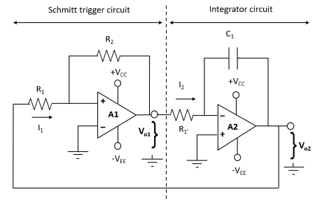
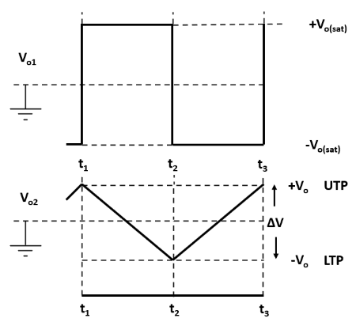

### Introduction

### **Sawtooth waveform:**

The sawtooth wave is a kind of linear, non-sinusoidal waveform. It is so named based on its resemblance to the teeth of a saw. The shape of this waveform is triangular in which the fall time and rise time are different. It can also be considered the extreme case of an asymmetric triangular wave. The graphical representation of a sawtooth waveform is given below:

**Fig.1- Sawtooth waveform** 

A sawtooth wave ramps upward and then sharply drops whereas in an inverse (or reverse) sawtooth waveform the wave suddenly ramps downwards and then rises sharply.
  

A sawtooth wave can be constructed using additive synthesis. The infinite Fourier series

 

converges to a reverse (inverse) sawtooth wave. A conventional sawtooth can be constructed using

 

Where A is amplitude

### **Applications:**

1\. A sawtooth wave's spectrum contains both even and odd harmonics of the fundamental frequency. Because it contains all the integer harmonics, it is one of the best waveforms to use for subtractive synthesis of musical sounds, particularly bowed string instruments like violins and cellos, since the slip-stick behavior of the bow drives the strings with a sawtooth-like motion.  
2\. The sawtooth wave is the form of the vertical and horizontal deflection signals used to generate a raster on CRT-based television or monitor screens. Oscilloscopes also use a sawtooth wave for their horizontal deflection, though they typically use electrostatic deflection.

### **Methods to generate the sawtooth wave:**

There are many ways to generate sawtooth wave as: By Using transistor, ICs as 741, TL082, TL084, combination of IC 555 and 741, integrating square wave with a feedback capacitance, Unijunction Transistor (UJT) but we are using OP-Amp IC 741 to generate sawtooth waveform.

### **IC Configuration:**

IC 741 usually called as op-amp 741 is 8 pin dual in-line package (DIP) integrated circuit. The pin configuration of Op –amp IC is shown in fig.2. Terminals 2 and 3 are called input terminals. Signal applied to terminal 2 is arrived at the output terminal with the negative sign hence it is called inverting terminal while the signal applied to the terminal 3 is arrived with same sign at the output hence it is called non-inverting terminal. Power supply of +15V and -15V are applied at terminals 7 and 4 respectively. The output is obtained at the terminal 6. Terminal 1 is offset null because it has no use in general operations. The name op-amp 741 is given to this integrated circuit as it is clear from its pin configuration that there are 7 active pins having 4 input terminals (2, 3, 4 and 7) and one output terminal (6th terminal ).

.png)

**Fig.2- Pin diagram of an op amp IC 741**

### **Working:**

The circuit in fig.3a consists of a non-inverting Schmitt trigger circuit and an integrator. This combination constitutes a triangular waveform generator. A duty cycle less than 50% causes the output of A2 to be sawtooth. The integrator output is applied to the Schmitt circuit input, and the Schmitt output is the integrator input. As illustrated by the circuit waveforms (fig.3b), the integrator produces a triangular output waveform when it has a square wave input. The Schmitt output changes from one saturation level to the other each time the integrator output arrives at the Schmitt UTP (Upper Trigger Point) or LTP (Lower Trigger Point).

 

**Fig.3a - Triangular wave generator.**

**Fig.3b - Circuit waveforms.**

  
During the time from instant t1 to the instant t2, the Schmitt output is positive (at +Vo(sat)) and current I2 flows into R1' charging C1, as illustrated. Thus, the integrator output is changing at a constant rate in a negative going direction. The output change is ∆V; from +Vo to –Vo. When the integrator output arrives at the LTP, the Schmitt output switches from +Vo(sat) to – Vo(sat). The integrator input is now a constant negative voltage, so that the input current direction is reversed and the output ramp voltage direction is reversed. From t2 to t3, the integrator output increases linearly from –Vo to +Vo, that is from the Schmitt LTP to its UTP. At the UTP, the Schmitt output reverses again, causing the integrator output to reverse direction once more. The cycle repeats again and again producing a triangular waveform at the integrator output and a square wave at the Schmitt output.

### **Duty Cycle Adjustment:**

Consider the rectangular wave output in fig.3b. The time from t1 to t2 is usually referred to as the pulse width (PW), and the time from t2 to t3 is referred to as the space width (SW). The duty cycle (DC) is the percentage of the time period (T) occupied by the PW. A square wave has a 50% DC, which means that PW and SW are equal. If PW is greater than SW, the DC is greater than 50%. If PW is less than SW, the DC is less than 50%. A duty cycle less than 50% causes the output of A2 to be sawtooth.

 

**Fig.4a - Modification for duty-cycle adjustment.**

**Fig.4b - Circuit waveform.**

 

The DC of the output can be varied by replacing R1' with two different value charge and discharge resistors in series with diodes as shown in fig.4a. When the integrator input (the Schmitt output) is positive, the charging current flows via D1 and R3. When the integrator input is negative, the charging current flows via D2 and R4. When R3 << R4, I3 >> I4, and so the negative going ramp output from the integrator is much steeper than the positive going ramp, as illustrated in fig.4b. Thus, the circuit becomes a ramp generator or sawtooth waveform generator.

The circuit for generating sawtooth wave using Op-Amp 741 where, R3 << R4 is given below:

**Fig.5 - Circuit diagram of sawtooth wave generator.**  

Frequency of the generated sawtooth wave can be calculated by -

**f = (1 / 2C1(R3+R4)) × (R2 / R1)** 

